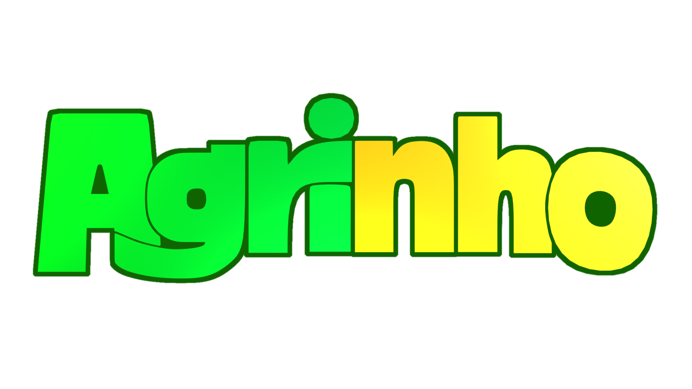
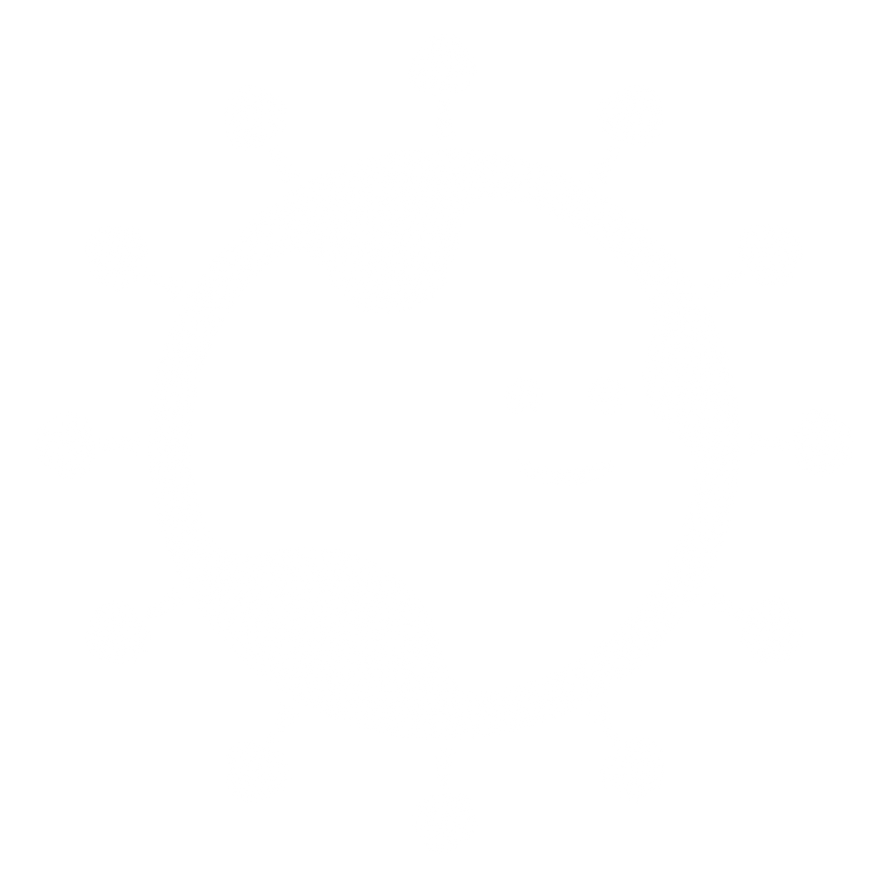

---

### "Agro forte, futuro sustentável: equilíbrio entre produção e meio ambiente"

---

O **Programa Agrinho** tem como principal objetivo aproximar os estudantes do campo, de uma forma em que todos tenham um conhecimento de práticas que beneficiem a agricultura do estado.

---
---
## PROGRAMAS UTILIZADOS >

---

Utilizado para a programação do projeto, incluindo os testes e o manuseio de arquivos.

---

Utilizado para a criação dos ícones do site, todos eles foram "desenhados" em sua forma tridimensional e carregados em forma de imagem.

---

---

Utilizado para a edição de imagens, principalmente o ajuste da logo do site.

---

### Confira o site por este link! >
https://lucas-de-lara-biasi.github.io/Agrinho-2026/

